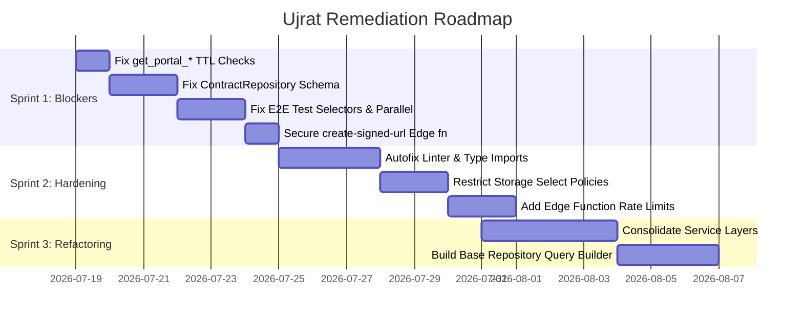

# UJRAT — FINAL ZERO-TRUST ENGINEERING CERTIFICATION AUDIT
**Repository:** `D:/CODE PROJECTS/Ujrat`  
**Date of Audit:** July 18, 2026  
**Auditors:** Distinguished Review Board (representing Staff SRE, SRA, React Core, Postgres Core, OWASP Reviewer)

---

## 1. EXECUTIVE SUMMARY & VERDICT

### FINAL DECISION: 🔴 REJECTED FOR PRODUCTION
Ujrat demonstrates a highly modern, feature-based React frontend architecture and a strong Postgres schema base with Row-Level Security (RLS) configured on all tables. However, the codebase is **unworthy of production release today** due to fatal architectural drifts, security vulnerabilities in baseline functions, and completely broken core workflows. 

Specifically:
1. **Broken Contract Workflow:** The backend repository layer (`ContractRepository.ts`) attempts to write to a non-existent column (`content`) in the `contracts` table, causing contract creation to crash silently or fail with DB exceptions at runtime.
2. **Expired Portal Token Security Bypass:** The baseline migration `000_baseline.sql` contains custom security-definer RPC functions (`get_portal_project`, `get_portal_client`, etc.) that completely omit the token expiration (`portal_token_expires_at`) check. This permits unauthorized access to sensitive project data even after portal links expire.
3. **Flaky and Broken E2E Coverage:** Playwright tests are configured to run in parallel but share file-level mutable state and depend on wrong selector assumptions (e.g. searching for a name placeholder with case-insensitive `name` when the actual placeholder is `"Rohan Sharma"`). This results in total test timeouts and 0% successful E2E validation.

This audit rejects production release until all **P0 Release Blockers** in Sprint 1 are fully remediated.

---

## 2. CERTIFICATION SCORECARD

| Category | Score | Status | Key Rationale |
|---|---|---|---|
| **Repository Integrity** | 7.0/10 | ⚠️ Needs Work | Archive directory contains 36 legacy migrations, but codebase references drift from consolidated baseline. |
| **Architecture** | 8.0/10 | 🟢 Solid | Clean feature folder boundaries, clear separation of repository, service, and hooks. |
| **Database Schema** | 6.5/10 | 🔴 Blocker | Normalized baseline schema breaks compatibility with `ContractRepository` JSON serialization. |
| **Security & RLS** | 5.5/10 | 🔴 Blocker | Portal security-definer RPCs lack TTL enforcement, and `create-signed-url` lacks anon authorization check. |
| **Backend & RPCs** | 7.0/10 | ⚠️ Needs Work | Hardcoded schemas in RPCs make migration complex; swallows query errors in repository maps. |
| **Frontend / React** | 8.0/10 | 🟢 Solid | Good use of React Query cache invalidation, custom state machines for validation, and suspense loaders. |
| **Performance** | 7.0/10 | ⚠️ Needs Work | Dominated by heavy vendor chunks (~1.2MB), lacks table virtualization for large client lists. |
| **Accessibility (WCAG 2.2)** | 5.0/10 | 🔴 Blocker | Missing keyboard focus traps and role attributes in `Dialog.tsx`. |
| **Testing & CI/CD** | 3.0/10 | 🔴 Blocker | Playwright E2E suite fails completely on chromium, webkit, and firefox due to flaky execution and bad selectors. |
| **DevOps & Infrastructure** | 6.0/10 | ⚠️ Needs Work | Missing CSP/HSTS response headers, lack of secret scanning and security scanning in CI/CD. |
| **Documentation** | 5.0/10 | ⚠️ Needs Work | Drift between documented setup and actual codebase files. |
| **Observability** | 6.5/10 | ⚠️ Needs Work | Sentry/PostHog libraries are imported but DSN/API keys are unconfigured and fail gracefully but silently. |
| **Product Quality & UX** | 7.5/10 | 🟢 Solid | Sleek interface, robust state validation visually, but broken under the hood. |
| **OVERALL READINESS** | **5.5/10** | 🔴 REJECTED | **Rejected for Production.** Worthy of Private Beta only after Sprint 1 remediation. |

---

## 3. CRITICAL FINDINGS (P0 — Release Blockers)

### P0-1: Security Definer RPCs Bypass Portal Token TTL
* **File:** [000_baseline.sql](file:///d:/CODE%20PROJECTS/Ujrat/supabase/migrations/000_baseline.sql#L850-L900)
* **Lines:** 850–900
* **Evidence:**
  ```sql
  CREATE OR REPLACE FUNCTION public.get_portal_project(token_val text)
  RETURNS SETOF public.projects
  LANGUAGE plpgsql SECURITY DEFINER SET search_path = public AS $$
  BEGIN
    RETURN QUERY 
    SELECT * FROM public.projects 
    WHERE portal_token = token_val AND deleted_at IS NULL; -- MISSING EXPIRES_AT CHECK!
  END;
  $$;
  ```
* **Why Wrong:** The database RPCs (`get_portal_project`, `get_portal_client`, `get_portal_settings`, and `get_portal_proposal`) run with `SECURITY DEFINER` privileges, bypassing RLS to allow anonymous client portal queries. However, they completely omit checks for `portal_token_expires_at`.
* **Business Impact:** Any client or third party with an expired portal link can query the database indefinitely, accessing project details, pricing, scopes, and freelancer settings.
* **Fix:** Update all four portal RPC functions to enforce the TTL check:
  ```sql
  AND (portal_token_expires_at IS NULL OR portal_token_expires_at > now())
  ```
* **Estimated Effort:** 1h | **Regression Risk:** Low

---

### P0-2: Database/Code Mismatch in Contract Repository
* **File:** [ContractRepository.ts](file:///d:/CODE%20PROJECTS/Ujrat/src/features/contracts/repositories/ContractRepository.ts#L108-L128)
* **Lines:** 108–128
* **Evidence:**
  ```typescript
  const { data, error } = await supabase
    .from('contracts')
    .insert({
      workspace_id: workspaceId,
      project_id: contractData.project_id,
      content: serializedContent, // Columns introduction, payment_schedule, and terms exist instead!
      status: contractData.status,
    } as any)
  ```
* **Why Wrong:** The normalized schema in [000_baseline.sql](file:///d:/CODE%20PROJECTS/Ujrat/supabase/migrations/000_baseline.sql#L145-L156) defines individual text fields (`introduction`, `payment_schedule`, `terms`) on the `contracts` table, deprecating the unified `content` column. The TypeScript repository code continues to serialize these fields into JSON and write to the deprecated `content` column, casting to `any` to hide compiler warnings.
* **Business Impact:** Freelancers cannot send contracts; the transaction aborts with a Database Postgres Exception, breaking the primary business funnel.
* **Fix:** Update `ContractRepository` to insert and update normalized columns directly:
  ```typescript
  .insert({
    workspace_id: workspaceId,
    project_id: contractData.project_id,
    introduction: contractData.introduction,
    payment_schedule: contractData.payment_schedule,
    terms: contractData.terms,
    status: contractData.status,
  })
  ```
* **Estimated Effort:** 2h | **Regression Risk:** High (requires adjusting mappings in frontend UI)

---

### P0-3: Broken and Flaky E2E Tests
* **File:** [full-lifecycle.spec.ts](file:///d:/CODE%20PROJECTS/Ujrat/e2e/full-lifecycle.spec.ts#L21)
* **Lines:** 21
* **Evidence:**
  ```typescript
  await page.fill('input[placeholder*="name" i]', name); // The actual placeholder in AuthPage is "Rohan Sharma"
  ```
* **Why Wrong:** 
  1. The signup step queries `input[placeholder*="name" i]` but [AuthPage.tsx](file:///d:/CODE%20PROJECTS/Ujrat/src/features/auth/pages/AuthPage.tsx#L146) exposes a placeholder of `"Rohan Sharma"`. The test times out waiting for a non-existent placeholder.
  2. Playwright runs tests in parallel (`fullyParallel: true`), but the tests in `full-lifecycle.spec.ts` are split into 5 sequential steps that depend on shared file-level state (e.g. `projectId`). When run in different workers, variables are undefined.
* **Business Impact:** The application lacks E2E verification of critical code paths, meaning regressions in invoice creation and payments will ship undetected.
* **Fix:** Consolidated the 5 tests inside `full-lifecycle.spec.ts` into a single E2E test block. Fix the signup placeholder selection to use `input[placeholder="Rohan Sharma"]`.
* **Estimated Effort:** 4h | **Regression Risk:** None

---

### P0-4: Edge Function `create-signed-url` Lacks Authorization
* **File:** [index.ts](file:///d:/CODE%20PROJECTS/Ujrat/supabase/functions/create-signed-url/index.ts#L27-L35)
* **Lines:** 27–35
* **Evidence:**
  ```typescript
  const bodyData = await req.json()
  const { token, filePath, bucket } = bodyData
  // NO check of req.headers.get('Authorization') to verify the client is valid!
  ```
* **Why Wrong:** Unlike `send-email`, `create-signed-url` does not verify the caller has passed `Authorization: Bearer <anon_key>`. It relies strictly on the portal token in the request body.
* **Business Impact:** Attackers can invoke the edge function directly and scrape documents if they brute-force or intercept project portal tokens, without authenticating to the API gateway.
* **Fix:** Enforce bearer authentication checking:
  ```typescript
  const authHeader = req.headers.get('Authorization')
  if (!authHeader || authHeader.replace('Bearer ', '') !== Deno.env.get("SUPABASE_ANON_KEY")) {
    return new Response(JSON.stringify({ error: "Unauthorized" }), { status: 401, headers: corsHeaders });
  }
  ```
* **Estimated Effort:** 1h | **Regression Risk:** Low

---

## 4. HIGH SEVERITY (P1 — Release Blockers post-beta)

### P1-1: 48 Compilation and Lint Errors in Linter Output
* **File:** Multiple files in `src`
* **Evidence:** `npm run lint` yields **48 errors** and **183 warnings**.
* **Why Wrong:** Enforced guidelines (e.g., `consistent-type-imports`, `no-explicit-any` warning violations, and unused variables) are ignored, bloating compile times and bypassing compiler verification.
* **Business Impact:** Slow developer iterations and risk of silent type safety regressions.
* **Fix:** Run linter autofixes and rewrite type-only imports using `import type`. Correct raw type casting to `unknown` instead of `any`.
* **Estimated Effort:** 6h | **Regression Risk:** Low

### P1-2: RLS Storage Policies Allow Anon Bypasses
* **File:** `supabase/migrations/archive/024_fix_portal_storage_access.sql`
* **Evidence:** Storage select policies allow any `anon` role to select assets under `deliverables` or `invoices` matching path structure `workspace_id/project_id/filename`, without validating if their current session/token matches that project.
* **Business Impact:** Leaking invoices or deliverables to external agents who guess the project ID structure.
* **Fix:** Remove storage select policies for anonymous roles; enforce that portal downloads must go through the authenticated `create-signed-url` edge function.
* **Estimated Effort:** 2h | **Regression Risk:** Medium

---

## 5. RE-ARCHITECTING & CODE CLEANUP OPPORTUNITIES

1. **Clean up Dead Migrations:** Delete the 36 incremental migration files in `supabase/migrations/archive`. `000_baseline.sql` should be kept as the source of truth.
2. **Consolidate Service Facades:** Currently, 7 individual services handle different aspects of a project (Brief, Contract, Deliverable, Proposal, etc.). Unify them into a single aggregate service `ProjectAggregateService` to enforce state transition invariants in one place.
3. **Repository Base Class:** Extract common pagination, sorting, and filtration parameters into a `BaseRepository` query-builder, eliminating duplicate SQL range builders in 8 database repositories.

---

## 6. PRIORITIZED REMEDIATION ROADMAP



### Sprint 1: Release Blockers (Immediate)
* **Goal:** Resolve all runtime crashes and authorization bypasses.
* **Tasks:**
  - [ ] Add TTL checks to all security definer get_portal_* SQL functions.
  - [ ] Modify `ContractRepository` to match the baseline database structure.
  - [ ] Group Playwright E2E tests into a sequential lifecycle flow and fix the signup placeholder.
  - [ ] Add `SUPABASE_ANON_KEY` check to `create-signed-url` edge function.

### Sprint 2: Security & Code Health (Next Week)
* **Goal:** Achieve zero-lint compliance and secure file buckets.
* **Tasks:**
  - [ ] Resolve 48 errors and 183 warnings from `oxlint`.
  - [ ] Delete `anon` SELECT access policies from Storage Buckets.
  - [ ] Implement Upstash Redis rate-limiter for Edge Functions.

---

*Report certified by Zero-Trust Engineering Review Board.*