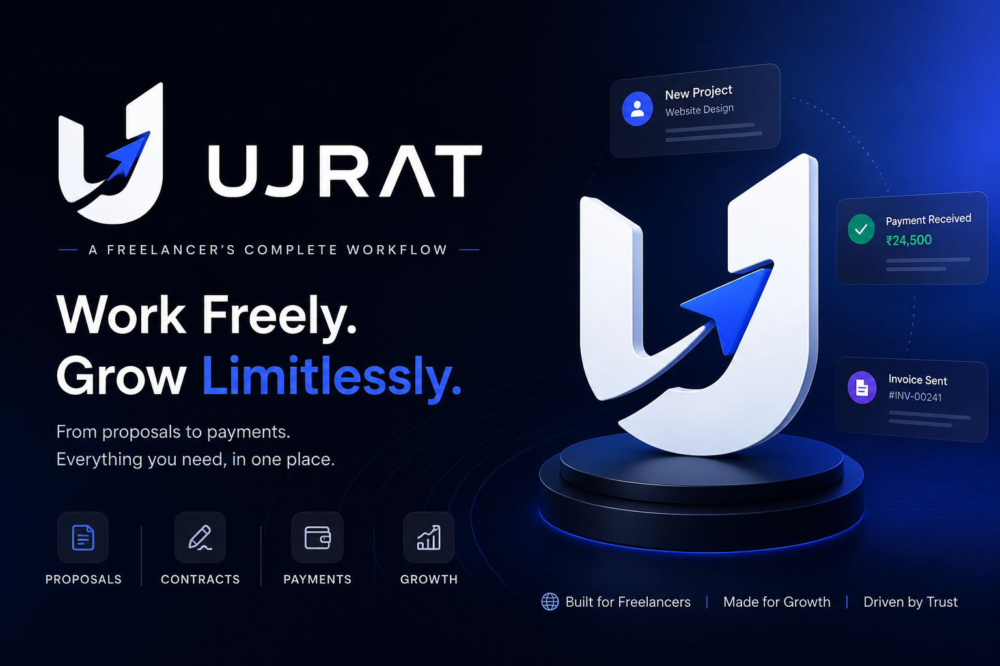

# 🚀 Ujrat

> **From first client contact to final payment — one workflow, zero chaos.**

<p align="center">
  
</p>

<p align="center">
  <strong>The modern workflow platform for freelancers.</strong><br>
  Built for Indian freelancers. Designed for simplicity. Engineered for scale.
</p>

<p align="center">
  
  
  
  
  
  
</p>

---

## Why Ujrat?

Freelancers don't need another CRM.

They don't need another project management tool.

They don't need another invoicing app.

They need **one workflow**.

Most freelancers today manage their business using:

* WhatsApp
* Google Docs
* Google Drive
* Excel
* Notion
* PDF generators
* Payment apps

Nothing connects.

Everything gets duplicated.

Clients get confused.

Payments get delayed.

Ujrat brings everything together into one seamless workflow.

```
Client
   ↓
Project
   ↓
Proposal
   ↓
Contract
   ↓
Advance Payment
   ↓
Work
   ↓
Invoice
   ↓
Payment
   ↓
Delivery
   ↓
Project Closed
```

---

# ✨ Features

## 👥 Client Management

* Client CRM
* Project history
* Notes
* Contact information
* Search & filtering

---

## 📂 Projects

* Kanban workflow
* Status tracking
* Milestones
* Deliverables
* Timeline
* Project notes

---

## 📝 Client Briefs

Generate a secure shareable link.

Clients submit

* Requirements
* Goals
* Budget
* Deadline
* References
* Attachments

---

## 📄 Proposals

Create beautiful proposals with

* Scope
* Deliverables
* Pricing
* Timeline
* Revision policy
* Terms

Supports

* Public links
* PDF export
* Approval workflow

---

## ✍️ Contracts

* Editable templates
* Digital acceptance
* PDF export
* Secure storage

---

## 🧾 GST Invoices

Generate professional invoices with

* GST
* CGST
* SGST
* IGST
* HSN Codes
* Discounts
* Notes

PDF Export included.

---

## 💳 Payments

Designed for India.

Supports

* UPI Intent Links
* Dynamic UPI QR Codes
* Google Pay
* PhonePe
* Paytm
* BHIM

Future support

* Razorpay
* Stripe

---

## 📁 Deliverables

Upload

* Images
* ZIP
* PDFs
* Videos
* Source Files

Clients receive a secure download portal.

---

## 🌐 Client Portal

Every project includes a dedicated client portal.

Clients can

* View proposal
* View contract
* Track progress
* Download deliverables
* View invoices
* Make payments

---

## 🔔 Notifications

Automatic emails for

* Proposal sent
* Proposal approved
* Contract signed
* Invoice generated
* Payment reminder
* Payment received
* Project delivered

---

# 🏗 Tech Stack

## Frontend

* React 19
* TypeScript
* Vite
* Tailwind CSS
* shadcn/ui
* React Router
* TanStack Query
* Zustand
* React Hook Form
* Zod

---

## Backend

Powered entirely by Supabase

* Authentication
* PostgreSQL
* Storage
* Realtime
* Edge Functions
* Row Level Security

---

## Infrastructure

* Vercel
* Resend
* Supabase Storage

---

# 📁 Project Structure

```
src/
│
├── app/
├── components/
│   ├── ui/
│   ├── layout/
│   └── shared/
│
├── features/
│   ├── auth/
│   ├── dashboard/
│   ├── clients/
│   ├── projects/
│   ├── briefs/
│   ├── proposals/
│   ├── contracts/
│   ├── invoices/
│   ├── payments/
│   ├── portal/
│   └── settings/
│
├── hooks/
├── services/
├── repositories/
├── schemas/
├── types/
├── utils/
├── constants/
├── lib/
├── store/
└── styles/
```

---

# 🗄 Database

Core tables

```
profiles

workspace_settings

clients

projects

project_briefs

proposals

proposal_sections

contracts

contract_signatures

invoices

invoice_items

payments

deliverables

notifications

activity_logs
```

Every table uses

* UUID
* Foreign Keys
* Indexes
* Row Level Security
* Audit timestamps

---

# 🔐 Security

Security is a first-class feature.

Implemented using

* Supabase Auth
* Row Level Security
* Secure Storage Policies
* Input Validation
* Environment Variables
* Workspace Isolation
* Activity Logs

Every user only has access to their own workspace.

---

# 🎨 Design Philosophy

Ujrat is designed around one principle.

> **Software should disappear into the workflow.**

Inspired by

* Linear
* Stripe
* Notion
* Vercel

Built with

* Minimal interfaces
* Strong typography
* Spacious layouts
* Fast interactions
* Accessible components
* Dark mode first

---

# 🚦 Workflow Engine

Every project follows a predictable lifecycle.

```
Lead

↓

Proposal

↓

Approved

↓

Contract Signed

↓

Advance Paid

↓

In Progress

↓

Delivered

↓

Invoice Sent

↓

Paid

↓

Archived
```

This workflow is the foundation of the platform.

---

# 🚀 Getting Started

## Clone

```bash
git clone https://github.com/yourusername/ujrat.git
```

---

## Install

```bash
npm install
```

---

## Environment Variables

Create a `.env.local` file in the root of the project with the following keys:

```env
# Supabase Configuration (Required)
VITE_SUPABASE_URL=your-supabase-url
VITE_SUPABASE_ANON_KEY=your-supabase-anon-key
SUPABASE_SERVICE_ROLE_KEY=your-supabase-service-role-key

# Application URL (Required)
VITE_APP_URL=http://localhost:5173

# Resend Email API (Required for email alerts)
VITE_RESEND_API_KEY=re_XXXXXXXXXX

# Sentry Error Tracking (Optional)
VITE_SENTRY_DSN=your-sentry-dsn
SENTRY_ORG=your-sentry-org
SENTRY_PROJECT=your-sentry-project
SENTRY_AUTH_TOKEN=your-sentry-auth-token

# PostHog Analytics (Optional)
VITE_POSTHOG_KEY=your-posthog-key
VITE_POSTHOG_HOST=https://app.posthog.com
```

---

## Run

```bash
npm run dev
```

---

## Build

```bash
npm run build
```

---

# 🤝 Contributing

Contributions are welcome.

Before opening a Pull Request

* Follow the existing architecture.
* Keep components reusable.
* Maintain TypeScript strictness.
* Write meaningful commit messages.
* Update documentation when required.

---

# 📜 License

This project is licensed under the MIT License.

---

# ❤️ Built For Freelancers

Ujrat isn't trying to become another bloated business suite.

It's built around a simple idea:

> **Freelancers should spend less time managing work and more time doing it.**

If Ujrat saves even one hour of administrative work each week, it's doing exactly what it was designed to do.

---

<p align="center">
  <strong>Ujrat</strong><br>
  <em>Built by a freelancer. Designed for freelancers.</em>
</p>
